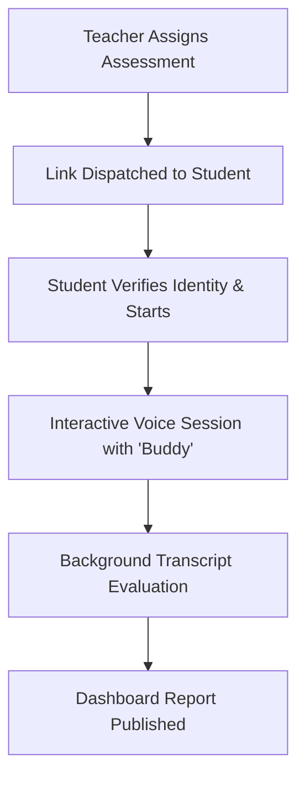
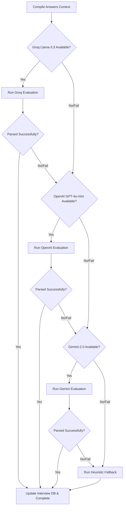

# Primary School Assessment: Interview & Report System Architecture

This document provides a comprehensive overview of how the interactive assessment interview works, the technology stack powering it, and the mechanics of response evaluation and report generation.

---

## 1. Technology Stack

The platform is designed as a modern, decoupled web application split into a frontend client and a backend API service:

### Frontend (Client)
* **Framework**: [Next.js 16](file:///Users/unnatishrotriya/Documents/Codebase/primary_%20assessment/frontend/package.json) (utilizing React 19 and TypeScript)
* **Styling**: Native CSS variables and custom utility styles for clean modern-enterprise dashboard widgets.
* **Audio & Speech APIs**:
  * **Text-to-Speech (TTS)**: Native browser Web Speech API (`window.speechSynthesis` and `SpeechSynthesisUtterance`) to read questions aloud.
  * **Speech-to-Text (STT)**: Web Speech API (`window.SpeechRecognition` or `window.webkitSpeechRecognition`) for capturing student speech transcripts in real-time.
* **API Communication**: [Axios](file:///Users/unnatishrotriya/Documents/Codebase/primary_%20assessment/frontend/package.json) for communicating with the backend API.

### Backend (Server & Database)
* **Framework**: FastAPI (Python 3.10+)
* **Database**: PostgreSQL (Production) / SQLite (Testing/Development) connected via SQLAlchemy ORM.
* **Migrations**: Alembic for managing schema changes.
* **Data Schemas**: Pydantic v2 for payload validation and serialization.

### Core Services & APIs
* **SendGrid API**: Utilized by the [EmailService](file:///Users/unnatishrotriya/Documents/Codebase/primary_%20assessment/backend/app/services/email_service.py) to email assessment invitation links to student/parent contact records.
* **AWS S3 Bucket**: Used for storing optional student media, pictures, and audit materials securely.
* **AI Providers (Hybrid Pipeline)**:
  * **Groq API**: Accessing `llama-3.3-70b-versatile` (fastest & cost-optimized provider for core evaluations).
  * **OpenAI API**: Fallback access to `gpt-4o-mini` for fallback generation.
  * **Google Generative AI**: Accessing `gemini-2.0-flash` for fallback grading, descriptive evaluations, and personalized advisory notes.

---

## 2. End-to-End Workflow

The system progresses through five distinct stages:

### Stage 2.1: Assessment Creation & Question Generation
Teachers or directors define assessments. The backend can auto-generate questions based on class level and chapter content via [QuestionGenerator](file:///Users/unnatishrotriya/Documents/Codebase/primary_%20assessment/backend/app/ai/question_generator.py):
1. The backend searches for configured AI keys using a hybrid fallback system:
   * **Groq** (`llama-3.3-70b-versatile`) $\rightarrow$ **Gemini** (`gemini-2.0-flash`) $\rightarrow$ **OpenAI** (`gpt-4o-mini`) $\rightarrow$ **Mock Fallback**.
2. Questions are generated as structured JSON containing text, options (if MCQ), difficulty, and cognitive levels.

### Stage 2.2: Assignment and Invitation Link Dispatch
When an assessment is assigned to a student (either individually or in bulk) in the [StudentAssessmentService](file:///Users/unnatishrotriya/Documents/Codebase/primary_%20assessment/backend/app/services/student_assessment_service.py):
1. A unique, single-use UUID token and a 24-hour expiration window are generated.
2. A database entry is created in `student_assessments` with a `Pending` status.
3. Access URL construction: `/assessment/verify?token=<token>&email=<encoded_student_email>`.
4. A simulated and real email invitation is dispatched to the student's email using SendGrid.

### Stage 2.3: Student Identity Verification
Before starting, the student lands on the verify route:
1. The token is checked for validity, usage status, and 24-hour expiration.
2. The student must verify their identity by entering their **Scholar ID** and **Student Name**.
3. If they match the database record, the student is allowed to enter.

---

## 3. Interactive Student Interview ('Buddy')

The student assessment experience is fully interactive and guided by **"Buddy"** (the virtual teacher's avatar). It is implemented in the frontend's [interview/[interviewId]/page.tsx](file:///Users/unnatishrotriya/Documents/Codebase/primary_%20assessment/frontend/src/app/interview/%5BinterviewId%5D/page.tsx):

### Audio and Voice Features
* **Graduation Cap Avatar & Status Indicator**: The interface shows a styled mortarboard avatar representing Buddy. Pulsing glow rings surround Buddy depending on status:
  * **Buddy is Speaking**: TTS is reading the question.
  * **Mic Active**: Student is speaking, and the browser is capturing microphone input.
  * **Listening**: The system is waiting for audio input.
* **Text-to-Speech (TTS) Flow**:
  * Buddy speaks the question aloud using `window.speechSynthesis`.
  * Special workarounds are implemented for known browser bugs (e.g., Chrome's 15-second TTS limit is bypassed by pausing and resuming the speech buffer programmatically).
* **Speech-to-Text (STT) Capture**:
  * Student responses are recorded via `webkitSpeechRecognition`.
  * **Silence Detection**: If the student stops speaking for a brief period, the mic auto-detects the pause and automatically logs/submits the text.
  * **Voice Commands**: The system checks if the student says phrases like *"repeat"* or *"can you repeat the question"*, which triggers Buddy to stop the current capture and speak the question again.
* **Keyboard Fallback**: If speech recognition fails, is denied microphone access, or isn't supported, a toggle button allows the student to manual-type their answers using an on-screen keyboard component.

---

## 4. Evaluation and Grading Mechanics

Once the student finishes all questions and submits, an evaluation background task is scheduled via `evaluate_interview_in_background` inside the backend's [InterviewService](file:///Users/unnatishrotriya/Documents/Codebase/primary_%20assessment/backend/app/services/interview_service.py):

### MCQ vs. Descriptive (TITA) Grading Logic
The evaluation pipeline divides questions into two categories:
1. **Multiple-Choice Questions (MCQ) & Mathematics**:
   * Evaluated via simple strict/float comparison rules in `_rule_based_evaluate` in [answer_evaluator.py](file:///Users/unnatishrotriya/Documents/Codebase/primary_%20assessment/backend/app/ai/answer_evaluator.py).
   * Checks if the student's typed or spoken option letter (e.g., "A", "B") or text matches the correct option.
2. **Type In The Answer (TITA) / Descriptive Questions**:
   * Graded conceptually. LLMs are asked to ignore spelling or grammatical issues and evaluate whether the student understood the core academic concept.

### Hybrid Evaluation Pipeline
To keep API latency and costs low, the backend runs student answers through a chain of fallback evaluations:

### The Heuristic Overlap Fallback
If all API connections are offline, a custom Python evaluation function is triggered:
1. **Normalizes Text**: Removes punctuation and lowercase-standardizes both answers.
2. **Numeric Extraction**: Extracts numbers to check if math figures match.
3. **Content Word Overlap**: Strips common stop-words (e.g., *the, is, an, with*) and calculates overlaps:
   * Correctness is marked as `true` if $\ge$ 40% of the content words in the expected answer are matched in the student's speech, or if $\ge$ 2 words match.
   * A synthetic score is assigned based on correctness and length (e.g., longer correct answers get higher scores).

---

## 5. Report Generation & Metrics

When the evaluation is complete, the `Interview` database entry is populated with the following fields:

| Field Name | Type | Description / Options |
| :--- | :--- | :--- |
| `overall_score` | Float | Calculated average score (0 to 100). |
| `grade` | String | Academic grades matching boundaries: `A+`, `A`, `B+`, `B`, `C`. |
| `recommendation` | String | Admission status recommendation: `Strongly Recommended`, `Recommended`, or `Needs Review`. |
| `score_communication` | Float | Evaluation score for speech clarity, promptness, and language. |
| `score_numeracy` | Float | Performance in math or numerical logic questions. |
| `score_creativity` | Float | Evaluated metric on descriptive, creative problem-solving questions. |
| `score_emotional_iq` | Float | Emotional intelligence quotient based on interactive basic social checkups. |
| `summary` | Text | A warm, encouraging 2-sentence feedback summary of the session. |
| `strengths` | Text | Bullet points highlighting 2-3 key concept strengths. |
| `improvements` | Text | Pedagogical action suggestions for growth areas. |
| `evaluated_answers`| JSON | A list of structures containing the question text, correct answer, student response, correctness flag (`isCorrect`), and a short explanation. |

### Results Dashboard
The report is rendered to the user and teacher in the Next.js results page:
1. **Polling Status**: The page automatically polls the backend API at a 3-second interval while the status is in `Evaluating` state.
2. **Caching**: Once complete, the JSON payload is cached in the browser's `sessionStorage` under `interview_report_<id>` so subsequent visits display immediately.
3. **Visualization**:
   * Renders a premium, animated radial SVG ring representing the student's overall score.
   * Renders visual horizontal bar tracks for each of the four core metrics (Communication, Numeracy, Creativity, Emotional IQ) with color themes matching the styling parameters (`var(--primary)`, `var(--secondary)`, `var(--accent)`, `var(--success)`).
   * Displays the detailed list of correct/incorrect questions, options, and AI evaluation feedback.
