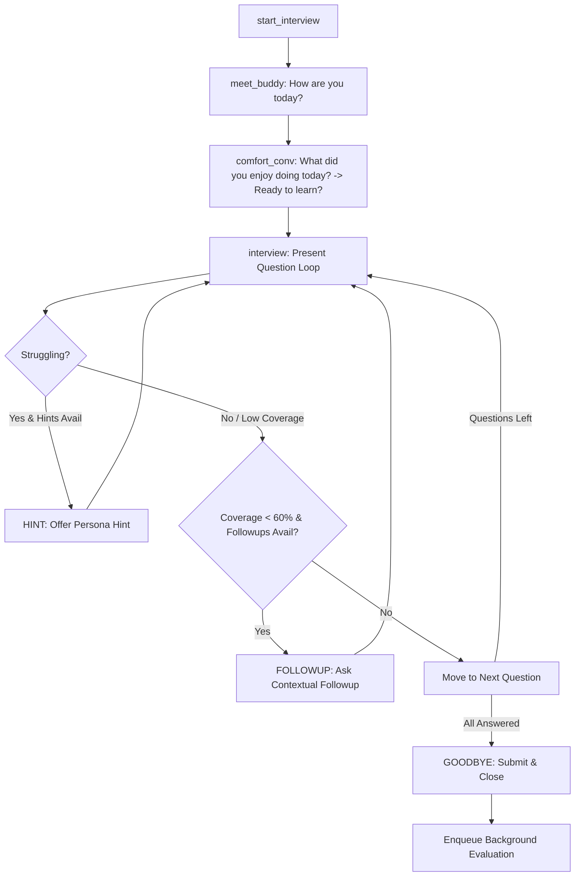
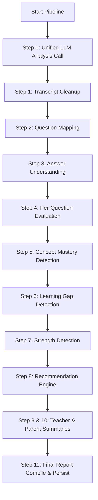

# Primary School Assessment: Interview & AI Evaluation Architecture

This document provides a comprehensive overview of how the interactive voice assessment works, the tech stack powering it, the APIs & API keys used, and the mechanics of real-time dialogue, asynchronous evaluations, and human-in-the-loop review.

---

## 1. Technology Stack

The platform is designed as a decoupled modern enterprise application consisting of a frontend client and a backend API service.

### 1.1 Frontend (Client)
* **Framework**: Next.js 16.2.6 (React 19.2.4, TypeScript) utilizing the App Router.
* **Styling**: Native CSS variables & custom utility styles matching the modern educational enterprise design language (no gradients, strict neutral backgrounds, crisp focus rings).
* **Audio & Voice Service**: Encapsulated in [voice.service.ts](file:///Users/unnatishrotriya/Documents/Codebase/primary_%20assessment/frontend/src/services/voice/voice.service.ts), which manages the lifecycle of speech capture and playback.
* **API Client**: Axios for backend communication.

### 1.2 Backend (Server & Database)
* **Framework**: FastAPI (Python 3.10+)
* **Database**: PostgreSQL 15 (Production) / SQLite (Development/Testing) with SQLAlchemy ORM.
* **Migrations**: Alembic.
* **Payload Validation**: Pydantic v2.
* **Task Queue**: Celery 5.3+ with Redis 7+ broker/backend (`CELERY_BROKER_URL`, `CELERY_RESULT_BACKEND`). Falls back to FastAPI's native `BackgroundTasks` if Redis is offline.

---

## 2. STT (Speech-to-Text) and TTS (Text-to-Speech) Services

The client-side `VoiceService` dynamically configures the voice engine by probing backend health at `/voice/health`.

### 2.1 Speech-to-Text (STT)

* **Hybrid Setup**:
  * **API/Whisper Mode (Preferred)**: If the backend voice service is healthy, the client uses the backend `/voice/transcribe` endpoint. The student's microphone stream is recorded using the HTML5 `MediaRecorder` API in `.webm` format and sent via `multipart/form-data`.
  * **Browser Mode (Fallback)**: Uses the native Web Speech API (`webkitSpeechRecognition` or `SpeechRecognition`) to transcribe speech directly in the browser.
* **Backend Processing**:
  * Done via `WhisperService` ([whisper_service.py](file:///Users/unnatishrotriya/Documents/Codebase/primary_%20assessment/backend/app/voice/whisper_service.py)).
  * Runs a local self-hosted **faster-whisper** model (defaulting to the `small` model size, running on CPU/CUDA, configured via `FASTER_WHISPER_MODEL`, `FASTER_WHISPER_DEVICE`, and `FASTER_WHISPER_COMPUTE_TYPE`).
  * Returns the transcript text, detected language, duration, and processing time.

### 2.2 Text-to-Speech (TTS)

* **Hybrid Setup**:
  * **API/Kokoro Mode (Preferred)**: If the backend voice service is healthy, the client uses the backend `/voice/speak` endpoint. It requests speech audio files from the backend, receiving a binary MP3 blob, and plays it via a custom HTML5 Audio context player.
  * **Browser Mode (Fallback)**: Uses the browser's native `window.speechSynthesis` and `SpeechSynthesisUtterance` (with a rate of `0.88` and pitch of `1.15`). Includes a keep-alive interval (which regularly pauses/resumes synthesized voices) to work around Chrome's 15-second speech limit bug.
* **Backend Processing**:
  * Done via `KokoroService` ([kokoro_service.py](file:///Users/unnatishrotriya/Documents/Codebase/primary_%20assessment/backend/app/voice/kokoro_service.py)).
  * Interfaces with a self-hosted local Kokoro container API (base URL `http://localhost:8880/v1`).
  * Utilizes a SHA-256 caching mechanism (`hashlib.sha256` hash of `text||voice||speed`) to store generated MP3 audio chunks under `cache/tts/`.
  * Splices/chunks long text sentences using punctuation boundaries to maintain voice synthesis quality, merges the resulting MP3 audio streams, and streams them back to the frontend.

---

## 3. Configuration & API Keys

The application runs using several external service integrations configured via environment variables in `app.core.config`:

* **`GROQ_API_KEY`**: Invokes the `llama-3.3-70b-versatile` model for fast evaluations, real-time dialogue responses, and primary question generation.
* **`GEMINI_API_KEY`**: Invokes the Google Generative AI SDK using the `gemini-2.0-flash` model for high-quality descriptive questions, detailed feedback summaries, and grading fallback support.
* **`OPENAI_API_KEY`**: Invokes `gpt-4o-mini` as a fallback grading and generation provider, and configures external Whisper API endpoints.
* **`SENDGRID_API_KEY` & `SENDGRID_FROM_EMAIL`**: Dispatches invitation links to parents and student contacts.
* **`AWS_ACCESS_KEY_ID` & `AWS_SECRET_ACCESS_KEY`**: Accesses S3 bucket `student-assessment-pictures-primary` in `us-east-1` for student media uploads, audio references, and textbook PDFs.
* **`KOKORO_API_KEY`**: Credentials for the Kokoro TTS API (optional, local container defaults require no key).

---

## 4. Interactive Dialogue & Assessment Flow

The interactive dialogue (managed by **Buddy**, the virtual school assistant) runs through a state machine inside the backend's `process_turn` method ([interview_service.py](file:///Users/unnatishrotriya/Documents/Codebase/primary_%20assessment/backend/app/services/interview_service.py)) and the custom `ConversationEngine` class:

### 4.1 Grade-Adapted Personas
When starting, Buddy dynamically configures voice speed, sentence length, and tone based on the student's academic class level:
* **Grade 1–2**: Cheerful, slow, highly expressive (`voice_speed`: "very slow", `sentence_limit`: 5–8 words).
* **Grade 3–5**: Friendly, encouraging, teacher-like (`voice_speed`: "normal", `sentence_limit`: 8–15 words).
* **Grade 6–8**: Energetic, professional (`voice_speed`: "normal", `sentence_limit`: 15–20 words).
* **Grade 9-10**: Calm, respectful, formal examiner style (`voice_speed`: "normal", `sentence_limit`: 20–25 words).

### 4.2 State Machine Lifecycle


1. **`meet_buddy` (Intro Phase)**: Buddy initiates contact. Asks: *"How are you today?"*
2. **`comfort_conv` (Comfort Building)**: 
   * Turn 1: Asks about student's day: *"What did you enjoy doing today?"*
   * Turn 2: Checks readiness: *"Ready to learn together?"*
3. **`interview` (Core Assessment Loop)**:
   * Loops through all questions compiled for the assessment.
   * Runs real-time evaluation on student speech: `_analyze_response_realtime` and `_check_heuristic_struggle` (checking for silence or struggle keywords like "don't know", "forgot", "skip").
   * **Hint Branch**: If the system detects the student is struggling (`is_struggling` is true) and hints are remaining, transitions to the `HINT` state, reads the hint, and prompts again.
   * **Follow-up Branch**: If concept coverage is low (under `0.6` / 60%) and follow-ups are remaining, transitions to the `FOLLOWUP` state and asks a follow-up question.
   * **Normal Transition**: Otherwise, moves to the next question. Resets counters, adds a random encouragement (e.g., *"Nice thinking! Let's try this next one."*), and increments `current_question_index`.
4. **`GOODBYE` (Completion)**:
   * Once all questions are answered, Buddy speaks a friendly farewell.
   * Saves the dialogue transcript to the database.
   * Sets `completion_status` to `"Completed"`, updates status to `"Transcript Saved"`.
   * Triggers the background evaluation task pipeline.

---

## 5. AI Evaluation and Grading Pipeline

The assessment grading pipeline is implemented in [evaluation_pipeline.py](file:///Users/unnatishrotriya/Documents/Codebase/primary_%20assessment/backend/app/services/evaluation_pipeline.py). It runs asynchronously (via Celery or background tasks) and progresses through 11 structured steps:



### The 11 Steps:

1. **Step 0: Unified LLM Analysis Call (`_call_unified_llm`)**
   * To minimize latency and costs, the pipeline queries LLMs in a hybrid fallback structure:
     * **Groq** (`llama-3.3-70b-versatile`) $\rightarrow$ **OpenAI** (`gpt-4o-mini`) $\rightarrow$ **Gemini** (`gemini-2.0-flash`) $\rightarrow$ **Local Heuristic Overlap Fallback**.
   * It requests a single aggregated JSON payload containing the cleaned dialogue, mapped questions, decoded answers, evaluations, concept scores, gaps, recommendations, and summaries. The result is cached in `self.cached_analysis`.
   * **Heuristic Fallback**: If all AI services fail, a local Python overlap matcher processes answers: it normalizes lowercase text, compares extracted numerical figures, and computes word overlap (marking answers correct if $\ge$ 40% or $\ge$ 2 content words overlap with the expected response).
2. **Step 2: Transcript Cleanup (`_step_transcript_cleanup`)**
   * Formats the student dialogue, stripping out speech disfluencies, filler words (e.g., "uh", "um"), and speech-to-text artifacts.
3. **Step 3: Question Mapping (`_step_question_mapping`)**
   * Maps student utterances and turns to specific questions in the assessment chronological order.
4. **Step 4: Answer Understanding (`_step_answer_understanding`)**
   * Extracts clean semantic student intents per question (decoding whether answers were skipped, partial, or had speech-to-text recognition issues).
5. **Step 5: Per-Question Evaluation (`_step_per_question_evaluation`)**
   * Evaluates correctness per question:
     * **MCQ**: Checks if the student's option letter (A, B, C, D) or matched option text is correct.
     * **TITA/Descriptive**: Performs conceptual checking. Focuses on whether the student understands the core academic concept, ignoring spelling and grammar issues.
6. **Step 6: Concept Mastery Detection (`_step_concept_mastery_detection`)**
   * Scores subject mastery, chapter mastery, and specific concept masteries (on a 0-100 scale). Calculates Bloom's cognitive taxonomy level distributions.
7. **Step 7: Learning Gap Detection (`_step_learning_gap_detection`)**
   * Pinpoints conceptual gaps and misconceptions, assigning them a severity rating (High, Medium, Low).
8. **Step 8: Strength Detection (`_step_strength_detection`)**
   * Extracts list of key learning strengths demonstrated by the student.
9. **Step 9: Recommendation Engine (`_step_recommendation_engine`)**
   * Computes actionable advice: recommended classroom activities, revision topics, and pedagogical next steps.
10. **Step 10: Teacher Summary (`_step_teacher_summary`)**
    * Generates a 2-3 sentence technical summary for the teacher's dashboard.
11. **Step 11: Parent Summary (`_step_parent_summary`)**
    * Drafts a warm, pedagogical letter (under 3 sentences) for the parent reporting the student's progress and strengths.
12. **Step 12: Final Report Compile & Persist (`_step_final_report`)**
    * Aggregates metrics, maps overall score to grade letters (`A+`, `A`, `B+`, `B`, `C`), computes a final recommendation status (`Strongly Recommended`, `Recommended`, or `Needs Review`), updates the database row status to `Report Ready`, and logs the completion timestamp.

---

## 6. Human Review and Approval Mode

To build teacher and director confidence, the platform includes a **Human Review Mode** allowing manual audits and grade overrides.

### 6.1 Database Verification Fields
The database schema tracks the review process via key metadata columns in the `interviews` table:
* `requires_review` (Boolean): Flagged if overall score confidence is low, or if transcription errors are suspected.
* `review_reason` (String): Diagnostic text indicating why review was flagged (e.g. "Low Speech Confidence", "Highly Discrepant Concept Scoring").
* `reviewed_by` (String): The username/name of the teacher who reviewed the report.
* `reviewed_at` (DateTime): The timestamp of the human sign-off.
* `admin_note` (Text): Custom teacher observation notes appended during review.

### 6.2 Review Endpoints
The backend router exposes endpoints to support the teacher review flow:
* **`PUT /api/v1/interviews/{interview_id}/review`**: Submits human overrides. The payload includes:
  ```json
  {
    "evaluated_answers": [
      {
        "question_text": "...",
        "is_correct": true,
        "score_override": 95,
        "teacher_explanation": "Explained concept clearly, minor vocabulary gap accepted."
      }
    ],
    "admin_note": "Student demonstrated excellent verbal engagement but needs revision on fraction numerators."
  }
  ```
  This service updates the evaluated answers, updates the overall score and grade letter, marks `requires_review = false`, records `reviewed_by` and `reviewed_at`, and transition the status to `Completed` (or `Report Ready`).

* **`POST /api/v1/interviews/{interview_id}/regenerate`**: Allows a teacher to trigger a prompt/worker evaluation regeneration if the model parsing failed or if they wish to re-evaluate from the raw saved messages transcript.
