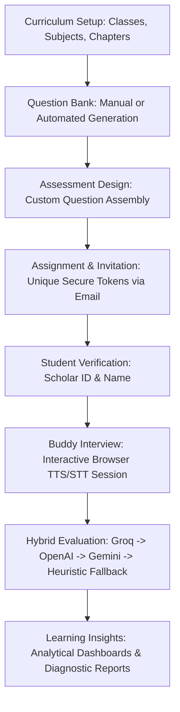

# Momentum: Educational Assessment Platform
## Complete Product Documentation & Feature Catalog

This document provides a comprehensive overview of the **Momentum** Primary School Assessment Platform, covering all system functionalities, database architecture, student-facing interview mechanics, evaluation workflows, and teacher-centric features.

---

## 1. Product Mission & Design Philosophy

**Momentum** is a modern academic management and educational assessment platform built to help teachers understand student learning per chapter while reducing manual administration. 

### Core Tenets:
* **Academic Integrity First:** The platform is styled and structured as a professional, academic tool. It aligns with existing school terminology (Classes, Subjects, Chapters, Scholar IDs) and behaves like a reliable enterprise school system.
* **Invisible Automation Engine:** Artificial Intelligence serves as the background execution engine for automated question generation and transcript grading. The user interface remains clean of chatbots, LLM prompts, model configurations, or generic "AI magic" wands.
* **Workflow-Focused:** Every action is designed to solve a single classroom objective in under three minutes, moving seamlessly from curriculum configuration to voice testing and detailed reports.

---

## 2. Platform Architecture & Navigation

The platform utilizes a structured, desktop-first split layout consisting of:
* **Persistent Left Sidebar:** Quick access to primary dashboards, class configurations, question banks, scheduled evaluations, and profile actions.
* **Persistent Top Header:** Breadcrumb navigation, contextual search, and notification/profile icons.
* **Scrollable Main Content Area:** Responsive, data-rich layouts with clean borders, cards, data tables, and forms.

### Primary Navigation Flow:
1. **Today (Dashboard):** A teacher's daily home base showing recent tasks, upcoming schedule, and calendar events.
2. **Assessments:** Create, assign, and track ongoing evaluations and tests.
3. **Students:** View the school scholar directory, individual learning paths, and progress trends.
4. **Learning Insights (Reports):** Access class performance distributions, sub-score metrics, strengths, and recommended pedagogical actions.
5. **Administration Menu (Collapsible):**
   * **Boards:** Global educational boards (Super Admin only).
   * **Classes:** School grades (e.g., Grade 3, Grade 4).
   * **Subjects:** Core subjects assigned to grade levels (e.g., Mathematics, English).
   * **Chapters:** Unit divisions for targeted testing.
   * **Saved Questions:** The custom question bank repository.
   * **Team:** Faculty management and permission matrices.
   * **School Settings:** Tenant settings, academic years, and registration codes.
6. **Control Panel:** Developer dashboard for database logs, token counts, and school onboarding (Super Admin only).

---

## 3. Detailed Features & Functionalities

### 3.1. User Role Management & RBAC (Role-Based Access Control)
The platform establishes three levels of administrative hierarchy:
* **Super Admin:** Manage onboarded school tenants, track global token consumption, inspect system logs, monitor diagnostic outputs, and troubleshoot database errors.
* **School Director / Admin:** Create and manage the school’s academic structures (Classes, Subjects, Chapters), onboard faculty members, and toggle granular permissions for each staff account.
* **Teacher:** Create and schedule assessments, generate questions, add students, and analyze learning insights.
* **Granular Feature Access Permissions:** Administrators can toggle specific modules (e.g., Reports, Student management, Syllabus editing) for individual team members.

---

### 3.2. Syllabus & Curriculum Setup
Before conducting evaluations, users can define their custom school curriculum hierarchy:
* **Classes:** Group students by grades (e.g., Class 1, Class 2, Class 3).
* **Subjects:** Assign core academic fields to grades (e.g., Grade 2 Mathematics, Grade 3 Science).
* **Chapters:** Break down subjects into sequential academic units (e.g., "Fractions & Decimals" under Grade 3 Mathematics) to ensure assessments align with exact classroom lessons.

---

### 3.3. Student Database & Scholar Profiles
* **Scholar Profiles:** Manage a centralized database of student profiles containing Scholar ID, Student Name, Grade Level, and parent email/phone contact details.
* **Individual Progress Dashboards:** Dive into any student's record to view:
  * Overall average assessment score.
  * Timeline of historical evaluations.
  * Concept strengths (e.g., "Identifies prime numbers", "Reads complex sentences").
  * Areas needing attention.
  * Printable summary reports.

---

### 3.4. AI-Assisted Question Bank
The system hosts a searchable database of testing items categorized as:
* **Multiple Choice Questions (MCQ):** Standard selection items.
* **Descriptive / TITA (Type In The Answer):** Open-ended conceptual items.
* **Manual Input:** Teachers can write and save custom questions.
* **Automatic Curriculum Generation:** Teachers can automatically generate questions by defining parameters:
  * **Class & Subject**
  * **Chapter / Unit**
  * **Difficulty level:** Easy, Medium, Hard.
  * **Bloom's Cognitive level:** Remembering, Understanding, Applying, Analyzing, Evaluating, Creating.
  * **Count:** Number of questions requested.
  * Output includes question body, answers, distractors, and helpful conceptual hints.

---

### 3.5. Assessment Creation & Distribution
* **Custom Assembly:** Bundle selected questions from the question bank into a themed Assessment.
* **Flexible Assigning:** Schedule an assessment for a whole class or individual students.
* **Secure Single-Use Access Tokens:** The system generates a secure, unique UUID token for each student assessment with a 24-hour expiration window.
* **SendGrid Integration:** Parents/students receive an automated, clean email invitation containing their custom URL to take the oral test.
* **Real-time Status Tracking:** The teacher's dashboard monitors invitations in real-time, showing states: `Pending`, `In Progress`, `Evaluating`, or `Completed`.

---

### 3.6. Student Interactive Voice Portal ('Buddy')
The student’s exam-taking experience is fully interactive, run locally in the browser, and guided by a friendly graduation-cap avatar named **"Buddy"**:
* **Identity Verification:** Prior to launch, the student must provide their **Scholar ID** and **Student Name** on the verification page. If they match the database record, access is granted.
* **Text-to-Speech (TTS) Engine:** Buddy reads each question aloud. Programmatic workarounds bypass browser limitations (such as the 15-second speech buffer limit in Chrome) to read long passages smoothly.
* **Visual Status Indicators:** Visual pulsing glow rings around Buddy change state depending on what the interface is doing:
  * *Buddy is Speaking:* Glowing speech rings.
  * *Mic Active / Listening:* Student microphone is on, capturing spoken responses.
* **Speech-to-Text (STT) Capture:** Spoken answers are translated into text in real-time.
* **Smart Silence Detection:** The browser automatically detects when the student has finished explaining (after a brief period of silence) and logs the transcript.
* **Voice Commands:** Students can say *"repeat"* or *"can you repeat the question"* to pause capture and have Buddy re-read the query.
* **Keyboard Fallback:** If microphone permission is blocked or speech recognition is unsupported, the student can toggle an on-screen visual keyboard to type their answers.

---

### 3.7. Multi-Model Hybrid Evaluation Pipeline
To maintain low API latency and robust cost control, student answers run through a background evaluation chain after submission:
1. **Rule-Based Pre-Evaluation:** MCQ answers and numerical math values are validated using exact string matching.
2. **Groq API Fallback:** Open-ended descriptions are evaluated using `llama-3.3-70b-versatile` for high-speed concept grading.
3. **OpenAI API Fallback:** Accesses `gpt-4o-mini` if Groq fails or rate limits are reached.
4. **Google Generative AI Fallback:** Uses `gemini-2.0-flash` for fallback grading and detailed descriptive feedback generation.
5. **Content Word Overlap Heuristic Fallback (Offline Mode):** If all internet/API connections fail, a local Python routine normalizes text, strips common stop-words, and calculates word overlap. If $\ge$ 40% of the core content words in the expected answer are matched, the question is marked correct.

---

### 3.8. Reports, Diagnostic Metrics & Insights
Once transcripts are analyzed, the system generates comprehensive analytical profiles:
* **Academic Metric Sub-scores (0-100):**
  * **Numeracy:** Numerical reasoning, calculations, and mathematical concepts.
  * **Communication:** Audio clarity, speech rate, sentence structure, and vocabulary.
  * **Creativity:** Creative reasoning and explaining concepts in their own words.
  * **Emotional IQ:** Emotional response, engagement, and confidence.
* **Overall Grading:** Automatically computes average scores, assign grades (`A+`, `A`, `B+`, `B`, `C`), and lists admission/readiness recommendations (`Strongly Recommended`, `Recommended`, `Needs Review`).
* **Qualitative Insights:** Generates encouraging summaries, 2-3 specific student strengths, and pedagogical recommendations for improvement.
* **Interactive SVG Visuals:** Results are animated using high-end radial score widgets and colored metrics tracks.
* **Caching:** Graded reports are cached in the browser's `sessionStorage` for immediate rendering on subsequent visits.

---

## 4. Database Schema Overview

The core entities powering the platform are structured as follows:

| Database Table | Entity | Key Attributes |
| :--- | :--- | :--- |
| `schools` | School Tenant | `id`, `tenant_id` (UUID), `name`, `created_at` |
| `admins` | Faculty Accounts | `id`, `tenant_id`, `name`, `email`, `hashed_password`, `role` (Admin/Director/Teacher), `allowed_features` (JSON array) |
| `classes` | Class / Grades | `id`, `tenant_id`, `name`, `board_id`, `created_at` |
| `subjects` | Subjects | `id`, `tenant_id`, `name`, `class_id`, `created_at` |
| `chapters` | Curriculum Units | `id`, `tenant_id`, `name`, `subject_id`, `order` |
| `questions` | Question Repository | `id`, `tenant_id`, `subject_id`, `chapter_id`, `difficulty` (Easy/Med/Hard), `cognitive_level`, `question_type` (MCQ/Descriptive), `text`, `options` (JSON), `correct_answer`, `hint` |
| `assessments` | Scheduled Test Sets | `id`, `tenant_id`, `title`, `description`, `question_ids` (JSON array), `created_by` |
| `students` | Scholar Profiles | `id`, `tenant_id`, `scholar_id`, `name`, `class_id`, `parent_email`, `parent_phone` |
| `student_assessments` | Assignments Tracker | `id`, `tenant_id`, `student_id`, `assessment_id`, `token` (Unique URL key), `status` (Pending/In_Progress/Evaluating/Completed), `score`, `expires_at` |
| `interviews` | Graded Session Data | `id`, `tenant_id`, `student_assessment_id`, `student_name`, `student_class`, `overall_score`, `grade`, `recommendation`, `score_communication`, `score_numeracy`, `score_creativity`, `score_emotional_iq`, `summary`, `strengths`, `improvements`, `transcript` (JSON conversation log), `evaluated_answers` (JSON detail per answer), `completed_at` |

---

## 5. Technology Stack & Key Libraries

### Frontend Client
* **Framework:** Next.js 16 (React 19, TypeScript) utilizing the App Router architecture.
* **Styling:** Vanilla CSS variables (`globals.css`) mapped to modern enterprise-style shadows, border-radii, and comfortable typography.
* **Audio Interactivity:** Native Browser Web Speech APIs (`SpeechSynthesis` & `webkitSpeechRecognition`).
* **HTTP Client:** Axios.

### Backend Server
* **Framework:** FastAPI (Python 3.10+) for high-concurrency API performance.
* **Database & ORM:** PostgreSQL database running SQLalchemy ORM for secure multi-tenant isolation.
* **Migrations:** Alembic.
* **Validation:** Pydantic v2.

### Integrations & Services
* **SendGrid API:** Dispatching parent assessment invitations.
* **AI Fallback APIs:** Groq SDK (`llama-3.3-70b-versatile`), OpenAI SDK (`gpt-4o-mini`), and Google GenAI SDK (`gemini-2.0-flash`).
