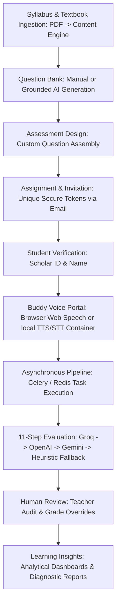

# Momentum: Educational Assessment Platform
## Complete Product Documentation & Feature Catalog

This document provides a comprehensive overview of the **Momentum** Primary School Assessment Platform, covering all system functionalities, database architecture, student-facing interview mechanics, evaluation workflows, and teacher-centric features.

---

## 1. Product Mission & Design Philosophy

**Momentum** is a modern academic management and educational assessment platform built to help teachers understand student learning per chapter while reducing manual administration. 

### Core Tenets:
* **Academic Integrity First:** The platform is styled and structured as a professional, academic tool. It aligns with existing school terminology (Classes, Subjects, Chapters, Scholar IDs) and behaves like a reliable enterprise school system.
* **Invisible Automation Engine:** Artificial Intelligence serves as the background execution engine for automated question generation and transcript grading. The user interface remains clean of chatbots, LLM prompts, model configurations, or generic "AI magic" wands.
* **Workflow-Focused:** Every action is designed to solve a single classroom objective in under three minutes, moving seamlessly from curriculum configuration to voice testing and detailed reports.

---

## 2. Platform Architecture & Navigation

The platform utilizes a structured, desktop-first split layout consisting of:
* **Persistent Left Sidebar:** Quick access to primary dashboards, class configurations, question banks, scheduled evaluations, and profile actions.
* **Persistent Top Header:** Breadcrumb navigation, contextual search, and notification/profile icons.
* **Scrollable Main Content Area:** Responsive, data-rich layouts with clean borders, cards, data tables, and forms.
* **Asynchronous Task Architecture:** Heavy computational work—such as parsing textbook PDFs and evaluating full student audio transcripts—is handled off the main request-response cycle by **Celery worker daemons** powered by a **Redis** message broker.

### Primary Navigation Flow:
1. **Today (Dashboard):** A teacher's daily home base showing recent tasks, upcoming schedule, and calendar events.
2. **Assessments:** Create, assign, and track ongoing evaluations and tests.
3. **Students:** View the school scholar directory, individual learning paths, and progress trends.
4. **Learning Insights (Reports):** Access class performance distributions, sub-score metrics, strengths, and recommended pedagogical actions.
5. **Administration Menu (Collapsible):**
   * **Boards:** Global educational boards (Super Admin only).
   * **Classes:** School grades (e.g., Grade 3, Grade 4).
   * **Subjects:** Core subjects assigned to grade levels (e.g., Mathematics, English).
   * **Chapters:** Unit divisions for targeted testing.
   * **Saved Questions:** The custom question bank repository.
   * **Team:** Faculty management and permission matrices.
   * **School Settings:** Tenant settings, academic years, and registration codes.
6. **Control Panel:** Developer dashboard for database logs, token counts, and school onboarding (Super Admin only).

---

## 3. Detailed Features & Functionalities

### 3.1. User Role Management & RBAC (Role-Based Access Control)
The platform establishes three levels of administrative hierarchy:
* **Super Admin:** Manage onboarded school tenants, track global token consumption, inspect system logs, monitor diagnostic outputs, and troubleshoot database errors.
* **School Director / Admin:** Create and manage the school’s academic structures (Classes, Subjects, Chapters), onboard faculty members, and toggle granular permissions for each staff account.
* **Teacher:** Create and schedule assessments, generate questions, add students, and analyze learning insights.
* **Granular Feature Access Permissions:** Administrators can toggle specific modules (e.g., Reports, Student management, Syllabus editing) for individual team members.

---

### 3.2. Syllabus & Curriculum Ingestion (NCERT Content Engine)
Before conducting evaluations, users can define their custom school curriculum hierarchy:
* **Classes & Subjects:** Group students by grades and assign core academic fields (e.g., Grade 3 Mathematics, Grade 2 English).
* **Chapters:** Break down subjects into sequential academic units.
* **NCERT Ingestion Pipeline:** Users can manually sync syllabus chapters with official NCERT textbooks. Under the hood, the backend content engine:
  1. Downloads the official chapter PDF from the NCERT repository (caching it locally or in an **AWS S3 bucket**).
  2. Extracts and cleans raw textbook page text via `pypdf`.
  3. Extracts inline illustrations, figures, and diagrams, saving them locally or uploading them to AWS S3.
  4. Structures textbook text into logical heading sections with HTML content using an AI-assisted parser (or a regular fallback heuristic).
  5. Links local chapter rows to the newly structured textbook content via a relational foreign key (`book_chapter_id`).

---

### 3.3. Student Database & Scholar Profiles
* **Scholar Profiles:** Manage a centralized database of student profiles containing Scholar ID, Student Name, Grade Level, and parent email/phone contact details.
* **Individual Progress Dashboards:** Dive into any student's record to view:
  * Overall average assessment score.
  * Timeline of historical evaluations.
  * Concept strengths (e.g., "Identifies prime numbers", "Reads complex sentences").
  * Areas needing attention.
  * Printable summary reports and observation notes.

---

### 3.4. AI-Assisted Question Bank & Textbook Grounding
The system hosts a searchable database of testing items categorized as:
* **Multiple Choice Questions (MCQ):** Standard selection items.
* **Descriptive / TITA (Type In The Answer):** Open-ended conceptual items.
* **Manual Input:** Teachers can write and save custom questions.
* **Textbook-Grounded Question Generation:** When syllabus chapters are synced with NCERT textbook content, teachers can automatically generate targeted questions:
  * **General Generation:** Generates questions based strictly and directly on the ingested chapter content sections, avoiding hallucinations.
  * **Selected Text Context Generation:** Teachers can highlight a specific paragraph or section from the textbook visual display and prompt the system to generate questions specifically based on the highlighted context.
  * **Bloom's Cognitive levels:** Remembering, Understanding, Applying, Analyzing, Evaluating, Creating.
  * **Verification & Citation Metadata:** Every AI-generated question is stamped with grounding details:
    * `source`: "NCERT Textbook"
    * `section`: The exact heading of the section where the question's content resides.
    * `page`: The corresponding textbook page number (if available).
    * `confidence`: An integer percentage (0-100) representing how closely and reliably the question is supported by the text.
    * `reference_text`: A verbatim quote of 1-2 sentences from the reference content that contains the factual answer/grounding.

---

### 3.5. Assessment Creation & Distribution
* **Custom Assembly:** Bundle selected questions from the question bank into a themed Assessment.
* **Flexible Assigning:** Schedule an assessment for a whole class or individual students.
* **Secure Single-Use Access Tokens:** The system generates a secure, unique UUID token for each student assessment with a 24-hour expiration window.
* **SendGrid Integration:** Parents/students receive an automated, clean email invitation containing their custom URL to take the oral test.
* **Real-time Status Tracking:** The teacher's dashboard monitors invitations in real-time, showing states: `Pending`, `In Progress`, `Evaluating`, or `Completed`.

---

### 3.6. Student Interactive Voice Portal ('Buddy')
The student’s exam-taking experience is fully interactive, run locally in the browser, and guided by a friendly graduation-cap avatar named **"Buddy"**:
* **Identity Verification:** Prior to launch, the student must provide their **Scholar ID** and **Student Name** on the verification page. If they match the database record, access is granted.
* **Hybrid Voice Services:** The voice engine dynamically selects the most robust speech synthesis and recognition setup:
  * **Self-Hosted Service (Preferred):** If backend voice health checks pass, speech synthesis (TTS) uses a local **Kokoro Container API** (chunking sentences at punctuation boundaries to maintain synthesis quality and caching results via SHA-256 hashes under `cache/tts/`). Speech recognition (STT) records student audio via the browser's `MediaRecorder` API in `.webm` format and transcribes it on the backend using a local self-hosted **faster-whisper** model.
  * **Browser Service (Fallback):** Bypasses backend endpoints and runs speech processes natively via browser Web Speech APIs (`SpeechSynthesisUtterance` at a rate of `0.88`, and `webkitSpeechRecognition`). Includes keep-alive intervals to bypass Chrome's 15-second speech buffer limitation.
* **Visual Status Indicators:** Visual pulsing glow rings around Buddy change state depending on what the interface is doing:
  * *Buddy is Speaking:* Glowing speech rings.
  * *Mic Active / Listening:* Student microphone is active, capturing spoken responses.
* **Smart Silence Detection:** The browser automatically detects when the student has finished explaining (after a brief period of silence) and logs the transcript.
* **Voice Commands:** Students can say *"repeat"* or *"can you repeat the question"* to pause capture and have Buddy re-read the query.
* **Keyboard Fallback:** If microphone permission is blocked or speech recognition is unsupported, the student can toggle an on-screen visual keyboard to type their answers.

---

### 3.7. V2 Conversation Engine & 11-Step Evaluation Pipeline
The platform leverages a custom state machine to manage active interview turns and evaluate them asynchronously.

#### Grade-Adapted Personas
Buddy dynamically adapts his verbal speed, sentence length, and pedagogical style based on the student's grade:
* **Grade 1–2**: Cheerful, slow, highly expressive (sentence limit: 5–8 words).
* **Grade 3–5**: Friendly, encouraging, teacher-like (sentence limit: 8–15 words).
* **Grade 6–8**: Energetic, professional (sentence limit: 15–20 words).
* **Grade 9–10**: Calm, respectful, formal examiner style (sentence limit: 20–25 words).

#### Interactive State Machine Flow
Buddy guides the student through four conversational phases:
1. `meet_buddy` (Intro): *"How are you today?"*
2. `comfort_conv` (Comfort Building): Asks about their day (*"What did you enjoy doing today?"*) and verifies readiness.
3. `interview` (Core Assessment Loop): Presents curriculum questions one by one.
   * **Hint Branch**: If the system detects the student is struggling (by recognizing silence, "don't know", or heuristic keywords like "skip" or "forgot"), Buddy reads a pre-configured concept hint.
   * **Follow-up Branch**: If student response semantic concept coverage is low (under 60%), Buddy prompts with a contextual follow-up question to probe understanding deeper.
4. `GOODBYE` (Completion): Speaks a warm farewell and saves the session transcript, triggering the evaluation task queue.

#### Asynchronous 11-Step Evaluation Pipeline
Once the session is submitted, a worker task runs the transcript through the evaluation pipeline:
1. **Step 0: Unified LLM Analysis Call:** Queries LLMs in a hybrid fallback structure (**Groq** `llama-3.3-70b-versatile` $\rightarrow$ **OpenAI** `gpt-4o-mini` $\rightarrow$ **Gemini** `gemini-2.0-flash` $\rightarrow$ **Local Heuristic Overlap Fallback**) to extract a single cached JSON analysis payload.
   * *Local Heuristic Overlap Fallback:* If all AI connections fail, a local Python routine normalizes text, strips common stop-words, and calculates word overlap. If $\ge$ 40% of the core content words in the expected answer are matched, the question is marked correct.
2. **Step 1: Transcript Cleanup:** Formats dialogue and strips speech disfluencies (e.g. "uh", "um").
3. **Step 2: Question Mapping:** Maps student utterances to specific questions.
4. **Step 3: Answer Understanding:** Decodes semantic intent (whether answers were skipped or had voice recognition errors).
5. **Step 4: Per-Question Evaluation:** Focuses on conceptual understanding rather than spelling/grammar.
6. **Step 5: Concept Mastery Detection:** Scores subject and chapter mastery (0-100) and mapping Bloom's taxonomy.
7. **Step 6: Learning Gap Detection:** Pinpoints conceptual gaps and severity (High, Medium, Low).
8. **Step 7: Strength Detection:** Highlights 2-3 key concept strengths.
9. **Step 8: Recommendation Engine:** Computes pedagogical advice and revision topics.
10. **Step 9: Teacher Summary:** Generates a 2-3 sentence report.
11. **Step 10: Parent Summary:** Drafts a warm progress update letter to parents.
12. **Step 11: Final Report Compile & Persist:** Aggregates metrics, calculates grades (`A+` to `C`), sets recommendation status, and marks report status as `Report Ready`.

---

### 3.8. Human Review & Approval Mode
To ensure absolute reliability, the system features a **Human Review Mode**:
* **Flagging for Review:** Reports that fall below confidence thresholds or encounter high-severity learning gaps are marked as `requires_review` with an associated `review_reason` stamp.
* **Teacher Verification Panel:** Teachers can access a detailed audit view of the student's submission, read the raw versus clean transcript, inspect visual audio waveforms (backed by S3 references), and verify correct/incorrect markings.
* **Manual Override:** Teachers can manually override AI-graded scores, edit evaluated answers, append custom observation comments (`admin_note`), and sign off on the report.
* **Status Lifecycle:** Tracks approval metadata (`reviewed_by`, `reviewed_at`) and locks the report status from future modifications.

---

### 3.9. Reports, Diagnostic Metrics & Insights
Once transcripts are analyzed and approved, the system generates comprehensive analytical profiles:
* **Academic Metric Sub-scores (0-100):**
  * **Numeracy:** Numerical reasoning, calculations, and mathematical concepts.
  * **Communication:** Audio clarity, speech rate, sentence structure, and vocabulary.
  * **Creativity:** Creative reasoning and explaining concepts in their own words.
  * **Emotional IQ:** Emotional response, engagement, and confidence.
* **Overall Grading:** Automatically computes average scores, assigns grades (`A+`, `A`, `B+`, `B`, `C`), and lists readiness recommendations (`Strongly Recommended`, `Recommended`, `Needs Review`).
* **Interactive SVG Visuals:** Results are animated using premium radial score widgets and colored metrics tracks.
* **Caching:** Graded reports are cached in the browser's `sessionStorage` for immediate rendering on subsequent visits.

---

## 4. Database Schema Overview

The core database tables and entity associations are structured as follows:

| Database Table | Entity | Key Attributes |
| :--- | :--- | :--- |
| `schools` | School Tenant | `id`, `tenant_id` (UUID), `name`, `created_at` |
| `admins` | Faculty Accounts | `id`, `tenant_id`, `name`, `email`, `hashed_password`, `role` (admin/director/teacher), `allowed_features` (JSON array) |
| `classes` | Class / Grades | `id`, `tenant_id`, `name`, `board_id`, `created_at` |
| `subjects` | Subjects | `id`, `tenant_id`, `name`, `class_id`, `created_at` |
| `chapters` | Curriculum Units | `id`, `tenant_id`, `name`, `subject_id`, `order`, `text_content`, `book_chapter_id` |
| `books` | NCERT Textbooks | `id`, `class` (grade level), `subject`, `title`, `language`, `edition`, `source` |
| `book_chapters` | Textbook Chapters | `id`, `book_id`, `chapter_number`, `title`, `slug`, `summary` |
| `chapter_sections` | Textbook Sections | `id`, `chapter_id`, `heading`, `order`, `html_content`, `plain_text` |
| `chapter_assets` | Textbook Illustrations | `id`, `section_id`, `asset_type` (e.g. image), `image` (file/S3 path), `caption` |
| `questions` | Question Repository | `id`, `tenant_id`, `class_id`, `subject_id`, `chapter_id`, `difficulty` (Easy/Med/Hard), `cognitive_level`, `question_type` (mcq/tita), `text`, `options` (JSON), `correct_answer`, `hint`, `session`, `source`, `section`, `page`, `confidence`, `reference_text`, `learning_objective`, `bloom_level`, `expected_concepts`, `rubric`, `common_mistakes`, `hints`, `followups`, `maximum_followups`, `minimum_coverage`, `ideal_answer_length`, `estimated_duration`, `scoring_rules` |
| `assessments` | Scheduled Test Sets | `id`, `tenant_id`, `title`, `description`, `question_ids` (JSON), `created_by`, `created_at`, `questions_to_ask`, `type` |
| `students` | Scholar Profiles | `id`, `tenant_id`, `scholar_id`, `name`, `class_id`, `parent_email`, `parent_phone`, `teacher_notes` |
| `student_assessments` | Assignments Tracker | `id`, `tenant_id`, `student_id`, `assessment_id`, `token` (Unique UUID key), `status` (Pending/In_Progress/Evaluating/Completed), `score`, `expires_at` |
| `interviews` | Graded Session Data | `id`, `tenant_id`, `student_assessment_id`, `assessment_id`, `student_name`, `student_class`, `overall_score`, `grade`, `recommendation`, `score_communication`, `score_numeracy`, `score_creativity`, `score_emotional_iq`, `summary`, `strengths`, `improvements`, `admin_note`, `evaluated_answers` (JSON detail per answer), `status` (In Progress/Completed/Evaluating/Report Ready), `started_at`, `completed_at`, `language`, `confidence`, `audio_references` (JSON), `report_version`, `current_question_index`, `session_state`, `comfort_index`, `raw_answers` (JSON), `network_status`, `completion_status`, `session_state_data` (JSON), `requires_review`, `review_reason`, `reviewed_by`, `reviewed_at`, `raw_transcript`, `clean_transcript`, `validated_transcript` |
| `interview_messages` | Dialogue Message Log | `id`, `interview_id`, `role` (ai/student), `text`, `question_category`, `sequence_number`, `question_id`, `student_response`, `buddy_response`, `audio_url`, `speech_confidence`, `created_at` |
| `interview_evaluation_steps`| Pipeline Step Tracker| `id`, `interview_id`, `step_name`, `status` (Pending/Running/Completed/Failed), `output` (JSON), `error`, `started_at`, `completed_at` |
| `conversation_turns` | V2 Structured Turns | `id`, `interview_id`, `question_id`, `buddy_message`, `student_transcript`, `audio_url`, `created_at` |
| `reports` | Legacy Flat Reports | `id`, `assessment_id`, `student_name`, `score`, `grade`, `duration`, `accuracy`, `completed_at`, `feedback`, `student_email`, `student_class`, `date_of_birth`, `contact` |

---

## 5. Technology Stack & Key Libraries

### Frontend Client
* **Framework:** Next.js 16.2.6 (React 19.2.4, TypeScript) utilizing the App Router architecture.
* **Styling:** Vanilla CSS variables (`globals.css`) mapped to modern enterprise-style shadows, border-radii, and comfortable typography.
* **Audio Interactivity:** Native Browser Web Speech APIs (`SpeechSynthesis` & `webkitSpeechRecognition`) as fallback.
* **HTTP Client:** Axios.

### Backend Server
* **Framework:** FastAPI (Python 3.10+) for high-concurrency API performance.
* **Database & ORM:** PostgreSQL 15 database (production) or SQLite (development/testing) running SQLAlchemy ORM for secure multi-tenant isolation.
* **Migrations:** Alembic.
* **Validation:** Pydantic v2.
* **Task Queue & Broker:** Celery 5.3+ with Redis 7+ broker (`CELERY_BROKER_URL`, `CELERY_RESULT_BACKEND`). Falls back to FastAPI's native `BackgroundTasks` if Redis is offline.

### Integrations & Services
* **SendGrid API:** Dispatching parent assessment invitations.
* **Local Self-Hosted Speech Container:**
  * **TTS:** Kokoro local container container API (`http://localhost:8880/v1`) using SHA-256 caching for synthesized MP3 segments.
  * **STT:** Local self-hosted `faster-whisper` (defaulting to the `small` model size, running on CPU/CUDA).
* **AWS S3 Integration:** Accesses bucket `student-assessment-pictures-primary` in `us-east-1` for storing student audio waveforms, uploads, and textbook PDFs.
* **AI Fallback APIs:** Groq SDK (`llama-3.3-70b-versatile`), OpenAI SDK (`gpt-4o-mini`), and Google GenAI SDK (`gemini-2.0-flash`).
