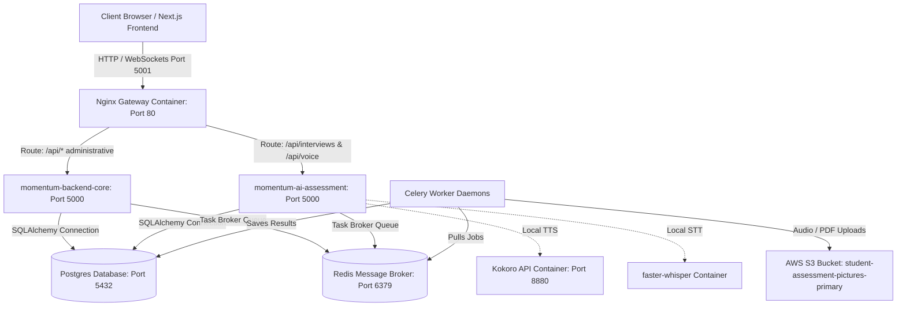

# Momentum: Backend Architecture & Engineering Documentation
## System Architecture, Database Schemas, and Background Services

This document provides a comprehensive overview of the **Momentum** Educational Assessment Platform backend. It covers the containerized services topology, gateway load-balancing configuration, directory layout, multi-tenant database schema, startup migration pipelines, API routing, asynchronous Celery workers, and the AI voice evaluation engine.

---

## 1. System Mission & Architectural Philosophy

The Momentum backend is built as a highly robust, multi-tenant enterprise system for educational assessment.

* **Academic Integration:** Fully aligned with academic terms (Schools, Classes, Subjects, Chapters, and Scholar Numbers).
* **Asynchronous Execution:** Heavy computation—such as transcript evaluation and textbook PDF parsing—is decoupled from HTTP request-response cycles.
* **Invisible Automation:** AI acts as a background processing utility. No direct user-facing chatbots or prompts are exposed in the core platform interfaces.
* **Multi-Tenant Isolation:** Administrative roles, student cohorts, question banks, and evaluation reports are scoped using tenant identifiers (`tenant_id`).

---

## 2. Infrastructure & Deployment Topology

Momentum uses a containerized multi-service architecture coordinated via Docker Compose and fronted by an Nginx reverse proxy.



### 2.1. Docker Container Services

As configured in [docker-compose.yml](file:///Users/unnatishrotriya/Documents/Codebase/primary_%20assessment/docker-compose.yml), the backend is split into independent services to improve scalability and system availability:

1. **`db` (momentum-db):** PostgreSQL 15 database on Alpine Linux. It maps local storage to the `postgres_data` volume and exposes port `5432` internally.
2. **`redis` (momentum-redis):** Redis 7 on Alpine Linux. Acts as the Celery message broker and result backend (port `6379`).
3. **`backend-core` (momentum-backend-core):** The core transaction application running with environment variable `APP_MODE=core`. It handles school onboarding, class management, team directory, and report reviews.
4. **`ai-assessment` (momentum-ai-assessment):** The interactive interview server running with `APP_MODE=ai-assessment`. It handles live student voice interactions, WebSocket handshakes, and STT/TTS transactions.
5. **`nginx` (momentum-gateway):** Nginx container that maps external port `5001` to internal port `80` using a custom routing design.

### 2.2. Nginx Gateway & Load Balancing Config

The entry gateway defined in [nginx.conf](file:///Users/unnatishrotriya/Documents/Codebase/primary_%20assessment/nginx.conf) performs path-based routing. Administrative workloads are isolated from real-time socket-based oral testing sessions:

* **Real-time Session Routing:** Incoming calls to `/api/interviews` and `/api/voice` are proxy-passed to the `ai_assessment` upstream pool (`momentum-ai-assessment:5000`). This ensures long-lived WebSockets and audio uploads do not block administrative workflows.
* **Core Route Routing:** All other administrative calls (`/api/auth`, `/api/classes`, `/api/subjects`, etc.) are proxy-passed to the `backend_core` upstream pool (`momentum-backend-core:5000`).
* **WebSocket Support:** Explicitly sets headers `Upgrade $http_upgrade` and `Connection "upgrade"` to support persistent connections for oral assessments.

---

## 3. Backend Directory Layout

The directory layout of the FastAPI backend application is structured as follows:

```
backend/
├── alembic.ini                   # Database migration configuration file
├── app/                          # Main FastAPI application container
│   ├── ai/                       # AI vendor provider wrappers (Gemini, OpenAI, Groq)
│   ├── api/                      # Routing layer
│   │   ├── router.py             # Global API route aggregator
│   │   └── [endpoints]/          # Context-specific API endpoints (e.g. auth, classes, questions)
│   ├── core/                     # Application configurations, security settings, and middlewares
│   │   ├── config.py             # Environment configurations (Pydantic-settings v2)
│   │   └── security.py           # Password hashing and JWT helpers
│   ├── db/                       # Database sessions, connection pools, and seeding data
│   │   ├── base.py               # Metadata registry combining SQLAlchemy models
│   │   ├── session.py            # Database engine and session context managers
│   │   └── seed_ncert.py         # Standard NCERT syllabus dataset seeding script
│   ├── models/                   # SQLAlchemy declarative model definitions
│   ├── repositories/             # Database access and query wrappers
│   ├── schemas/                  # Pydantic schema validation structures
│   ├── services/                 # Business logic and grading/interview workflows
│   ├── tasks/                    # Celery asynchronous task definitions (PDF parsing, transcripts)
│   ├── utils/                    # Common helper utilities (S3 uploaders, formatters)
│   └── voice/                    # Audio streaming, Whisper transcription, and Kokoro interfaces
├── cache/                        # Cached temporary assets (e.g. TTS voice caches)
├── static/                       # Static media files served via FastAPI
├── tests/                        # Comprehensive pytest test suite
└── requirements.txt              # Backend library dependency manifest
```

---

## 4. Database Architecture & Schema Dictionary

The system uses a single relational schema with multi-tenant isolation. Tables containing `tenant_id` columns restrict records to their respective school scopes.

### 4.1. Table Schemas Reference

#### 4.1.1. Core Administrative & Curricular Tables

##### Table: `schools` (School Tenants)
Stores onboarded school settings.
* `id` (Integer, Primary Key): Autoincrement identifier.
* `tenant_id` (String, Unique, Indexed): Scoped school token (e.g., `SCH-SYSTEM`).
* `name` (String): School display name.
* `created_at` (DateTime): Record creation timestamp.

##### Table: `admins` (Faculty Accounts)
Administrative credentials and feature configurations.
* `id` (Integer, Primary Key)
* `tenant_id` (String, Foreign Key to `schools.tenant_id`): School partition scope.
* `name` (String): User's name.
* `email` (String, Unique, Indexed): User credential login key.
* `hashed_password` (String)
* `role` (String, default `admin`): RBAC role (e.g., `admin`, `director`, `teacher`).
* `allowed_features` (JSON list): Explicit permissions checklist (e.g., `["dashboard", "classes", "reports"]`).

##### Table: `classes` (Grades / Classrooms)
Defines grade cohorts.
* `id` (Integer, Primary Key)
* `name` (String): Section or cohort name.
* `grade` (String): Core grade scale level (e.g. `Grade 3`).
* `section` (String): Section letter or code (e.g. `A`).

##### Table: `subjects` (Academic Subjects)
Subject areas associated with classes.
* `id` (Integer, Primary Key)
* `name` (String): Subject name (e.g., `Mathematics`).
* `code` (String, Unique, Indexed): Code string identifying the subject.
* `status` (String, default `Active`): Availability status.
* `class_id` (Integer, Foreign Key to `classes.id`): Associated class mapping.

##### Table: `chapters` (Curricular Units)
Subject chapters, synced with NCERT textbook context.
* `id` (Integer, Primary Key)
* `tenant_id` (String, Indexed): Tenant owner reference.
* `number` (String): Chapter position index.
* `title` (String): Chapter title text.
* `subject_id` (Integer, Foreign Key to `subjects.id`): Associated subject mapping.
* `content` (String, Nullable): Raw chapter notes.
* `text_content` (String, Nullable): Structured textbook page context content.
* `book_chapter_id` (Integer, Foreign Key to `book_chapters.id`): Backing NCERT mapping source.

---

#### 4.1.2. Ingested NCERT Textbook Tables (Content Engine)
System-wide reference tables loaded from textbook resources. These do not contain `tenant_id` columns since they are shared globally.

##### Table: `books`
NCERT Textbook metadata catalog.
* `id` (Integer, Primary Key)
* `class` (String): Target class level.
* `subject` (String): Curricular area.
* `title` (String): Title of the textbook.
* `language` (String, default `English`)
* `edition` (String, default `2026-27`)
* `source` (String, default `NCERT`)

##### Table: `book_chapters`
Individual chapters in NCERT textbooks.
* `id` (Integer, Primary Key)
* `book_id` (Integer, Foreign Key to `books.id`): Reference book.
* `chapter_number` (Integer): Chapter order.
* `title` (String): Title of the chapter.
* `slug` (String, Unique): Text-based identifier.
* `summary` (String, Nullable): Summary description.

##### Table: `chapter_sections`
Textbook page details broken down by headings.
* `id` (Integer, Primary Key)
* `chapter_id` (Integer, Foreign Key to `book_chapters.id`): Source book chapter.
* `heading` (String): Section heading text.
* `order` (Integer): Paragraph order key.
* `html_content` (String): Structured section text with HTML tags.
* `plain_text` (String): Plain text context for semantic grounding and extraction.

##### Table: `chapter_assets`
Illustrations and visual diagrams extracted from textbook PDFs.
* `id` (Integer, Primary Key)
* `section_id` (Integer, Foreign Key to `chapter_sections.id`): Associated textbook section.
* `asset_type` (String): E.g., `image`, `diagram`.
* `image` (String): Path to the image file or AWS S3 URI.
* `caption` (String, Nullable): Diagnostic or visual descriptor notes.

---

#### 4.1.3. Testing, Roster, & Evaluation Tables

##### Table: `questions` (Question Bank Repository)
Contains manually compiled and automatically generated test questions.
* `id` (Integer, Primary Key)
* `tenant_id` (String, Nullable): Scoped school partition.
* `question` (String / Database Column `question`): The testing question text.
* `options` (JSON): Possible choices (for MCQs).
* `expected_answer` (String / Database Column `expected_answer`): Grounded ideal correct answer.
* `question_type` (String, default `mcq`): MCQ or TITA (Type In The Answer).
* `difficulty` (String): `easy`, `medium`, or `hard`.
* `cognitive_level` (String): Bloom's taxonomy category (e.g. `remembering`, `applying`).
* `class_id` (Integer, Foreign Key to `classes.id`)
* `subject_id` (Integer, Foreign Key to `subjects.id`)
* `chapter_id` (Integer, Foreign Key to `chapters.id`)
* `generated_by` (String, Nullable): AI agent generator or system role template.
* `session` (String, Nullable): Academic session identifier (e.g., `2026-27`).
* `created_at` (DateTime): Registration timestamp.
* **Textbook Grounding Metadata:**
  * `source` (String, Nullable): References source material (e.g., `NCERT Textbook`).
  * `section` (String, Nullable): Specific textbook section heading name.
  * `page` (String, Nullable): Page number in the textbook.
  * `confidence` (Integer, Nullable): AI model generation confidence score (0-100).
  * `reference_text` (String, Nullable): The literal sentence containing the fact.
* **V2 Voice Engine Configurations:**
  * `learning_objective` (String, Nullable)
  * `bloom_level` (String, Nullable)
  * `expected_concepts` (JSON list, Nullable): Essential keywords/concepts for scoring.
  * `rubric` (Text, Nullable): Scoring rules for grading.
  * `common_mistakes` (JSON, Nullable)
  * `hints` (JSON list, Nullable): Hints provided when the student struggles.
  * `followups` (JSON list, Nullable): Secondary questions to explore understanding.
  * `maximum_followups` (Integer, default `2`): Limit on follow-up questions.
  * `minimum_coverage` (Float, default `0.6`): Threshold required to pass a question.
  * `ideal_answer_length` (Integer, default `50`): Expected answer length in words.
  * `estimated_duration` (Integer, default `120`): Expected testing time in seconds.
  * `scoring_rules` (Text, Nullable)

##### Table: `assessments` (Assigned Exam Headers)
Defines assessment configurations.
* `id` (Integer, Primary Key)
* `tenant_id` (String, Nullable)
* `title` (String): Assessment title.
* `subject_id` (Integer, Foreign Key to `subjects.id`)
* `class_id` (Integer, Foreign Key to `classes.id`)
* `status` (String, default `Scheduled`): `Scheduled`, `Active`, or `Completed`.
* `date` (String, Nullable): Scheduled test date.
* `questions_count` (Integer, default `0`): Precalculated total question count.
* `questions_to_ask` (Integer, default `5`): Subset size to deliver from the pool.
* `created_at` (DateTime)
* `type` (String, default `Assessment`)

##### Table: `assessment_questions` (M2M Link)
Maps questions to assessments.
* `assessment_id` (Integer, Foreign Key to `assessments.id`, Primary Key)
* `question_id` (Integer, Foreign Key to `questions.id`, Primary Key)

##### Table: `students` (Scholar Profiles)
Student directory records.
* `id` (Integer, Primary Key)
* `tenant_id` (String, Foreign Key to `schools.tenant_id`)
* `name` (String): Full student name.
* `email` (String): Student or parent email contact.
* `contact_number` (String, Nullable): Parent contact phone number.
* `scholar_number` (String, Unique, Indexed): Official student registration number.
* `picture_url` (String, Nullable): Link to the student's profile picture.
* `class_id` (Integer, Foreign Key to `classes.id`)
* `teacher_notes` (String, Nullable)

##### Table: `student_assessments` (Assignments Tracker)
Links students to assessments and tracks progress.
* `id` (Integer, Primary Key)
* `tenant_id` (String, Nullable)
* `assessment_id` (Integer, Foreign Key to `assessments.id`): Target exam.
* `student_name` (String): Copied name for quick access.
* `student_class` (String)
* `date_of_birth` (String): Student birthday verification string (`YYYY-MM-DD`).
* `student_email` (String)
* `contact` (String)
* `token` (String, Unique, Indexed): UUID security key used for single-use access.
* `created_at` (DateTime)
* `expires_at` (DateTime): Verification expiration window.
* `is_used` (Boolean, default `False`): Protects against multiple submissions.
* `session_id` (String, Nullable): Active websocket session reference.
* `status` (String, default `Pending`): `Pending`, `Started`, `Completed`, or `Expired`.

##### Table: `interviews` (Graded Session Records)
Stores conversation transcripts and generated grading reports.
* `id` (Integer, Primary Key)
* `tenant_id` (String, Nullable)
* `student_assessment_id` (Integer, Foreign Key to `student_assessments.id`): Source token mapping.
* `assessment_id` (Integer, Foreign Key to `assessments.id`)
* `student_name` (String)
* `student_class` (String)
* `status` (String, default `In Progress`): `In Progress`, `Completed`, `Evaluating`, or `Report Ready`.
* `started_at` (DateTime)
* `completed_at` (DateTime, Nullable)
* `transcript` (Text, Nullable): Raw JSON dialogue array backup.
* **Diagnostics Metrics:**
  * `overall_score` (Float, Nullable): Cumulative score (0-100).
  * `grade` (String, Nullable): Computed grade label (`A+`, `A`, `B+`, `B`, `C`).
  * `recommendation` (String, Nullable): Readiness status (`Strongly Recommended`, `Recommended`, `Needs Review`).
  * `score_communication` (Float, Nullable)
  * `score_numeracy` (Float, Nullable)
  * `score_creativity` (Float, Nullable)
  * `score_emotional_iq` (Float, Nullable)
* **Written Reports:**
  * `strengths` (Text, Nullable): Key concept strengths.
  * `improvements` (Text, Nullable): Core learning gap areas.
  * `admin_note` (Text, Nullable): Optional teacher evaluation override comments.
  * `summary` (Text, Nullable): Comprehensive diagnostic review summary.
  * `evaluated_answers` (JSON, Nullable): Per-question grading details.
* **V2 Pipeline Progress Tracker Columns:**
  * `language` (String, default `en-US`)
  * `confidence` (Float, Nullable): Transcription confidence.
  * `audio_references` (JSON, Nullable): Map of audio file links stored in S3.
  * `report_version` (String, default `2.0.0`)
  * `current_question_index` (Integer, default `0`)
  * `session_state` (String, default `meet_buddy`): Interactive state machine position.
  * `comfort_index` (Integer, default `0`): Conversational progress state.
  * `raw_answers` (JSON, Nullable): Raw speech-to-text response objects.
  * `network_status` (String, default `online`): Tracking network states.
  * `completion_status` (String, default `In Progress`)
  * `session_state_data` (JSON, Nullable): Internal session state attributes.
  * `requires_review` (Boolean, default `False`): Triggers teacher verification panel if True.
  * `review_reason` (String, Nullable): Reason flag trigger (e.g. `Low Confidence`).
  * `reviewed_by` (String, Nullable): Name of auditor.
  * `reviewed_at` (DateTime, Nullable): Manual override date.
  * `raw_transcript` (Text, Nullable)
  * `clean_transcript` (Text, Nullable)
  * `validated_transcript` (Text, Nullable)

##### Table: `interview_messages` (Message Logger)
Chronological log of messages during interview sessions.
* `id` (Integer, Primary Key)
* `interview_id` (Integer, Foreign Key to `interviews.id`)
* `role` (String): `ai` or `student`.
* `text` (Text): The transcript dialogue.
* `question_category` (String, Nullable): E.g., `meet_buddy`, `comfort_conv`, `interview`, `GOODBYE`.
* `created_at` (DateTime)
* `sequence_number` (Integer, Nullable): Ordered position index.
* `question_id` (Integer, Nullable): Link to the target question.
* `student_response` (Text, Nullable)
* `buddy_response` (Text, Nullable)
* `audio_url` (String, Nullable): Audio storage path.
* `speech_confidence` (Float, Nullable): STT confidence metric.

##### Table: `interview_evaluation_steps` (Celery Tasks Logs)
Monitors step execution in the asynchronous grading engine pipeline.
* `id` (Integer, Primary Key)
* `interview_id` (Integer, Foreign Key to `interviews.id`)
* `step_name` (String): Current processing step (e.g. `transcript_cleanup`, `question_mapping`).
* `status` (String, default `Pending`): `Pending`, `Running`, `Completed`, or `Failed`.
* `output` (JSON, Nullable): Output from the step's execution.
* `error` (Text, Nullable): Crash traceback, if applicable.
* `started_at` (DateTime)
* `completed_at` (DateTime, Nullable)

##### Table: `conversation_turns` (V2 Structured Dialogue Turns)
Tracks structured question-and-answer pairs.
* `id` (Integer, Primary Key)
* `interview_id` (Integer, Foreign Key to `interviews.id`)
* `question_id` (String, Nullable): Target question identifier.
* `buddy_message` (Text, Nullable): Voice output by Buddy.
* `student_transcript` (Text, Nullable): Transcribed student speech response.
* `audio_url` (String, Nullable): Saved audio file reference.
* `created_at` (DateTime)

##### Table: `reports` (Legacy Flat Records)
Used for backwards compatibility.
* `id` (Integer, Primary Key)
* `assessment_id` (Integer, Foreign Key to `assessments.id`)
* `student_name` (String)
* `score` (Float): Overall grade percentage.
* `grade` (String): E.g. `A`.
* `duration` (String): E.g., `45 mins`.
* `accuracy` (Float)
* `completed_at` (String, Nullable)
* `feedback` (String, Nullable)
* `student_email` (String, Nullable)
* `student_class` (String, Nullable)
* `date_of_birth` (String, Nullable)
* `contact` (String, Nullable)

---

## 5. Schema Migration & Startup Seeding Pipeline

### 5.1. Migrations Management
The application manages database schema evolutions using Alembic and programmatic migrations:

* **Alembic Versioning:** Production Postgres deployments run through standard migration scripts in [app/db/migrations/](file:///Users/unnatishrotriya/Documents/Codebase/primary_%20assessment/backend/app/db/migrations/).
* **Startup Migrations:** To prevent SQLite dev environments from breaking, [app/main.py](file:///Users/unnatishrotriya/Documents/Codebase/primary_%20assessment/backend/app/main.py) automatically runs `Base.metadata.create_all` and runs conditional `ALTER TABLE ... ADD COLUMN ...` queries on startup. This dynamically handles new column additions for features like `questions` V2 compiler fields and `interviews` status flags.

### 5.2. Seeding Strategy
On startup, if the database is unpopulated, the seeding pipeline executes:

1. **School Tenant:** Configures the default school (`SCH-SYSTEM`, "Momentum Central School").
2. **Default Administrator:** Creates user `admin@example.com` (password: `admin123`) with role `admin` and access to all core modules.
3. **NCERT Chapters & Questions Syllabus Seeding:** Runs [app/db/seed_ncert.py](file:///Users/unnatishrotriya/Documents/Codebase/primary_%20assessment/backend/app/db/seed_ncert.py) to seed Grade 1–5 Math and English classes, core subjects, chapters, and sample question banks.

---

## 6. API Routing Architecture & RBAC

API endpoints are mapped using FastAPI routers, grouped by service features.

```
api_router (app/api/router.py)
├── /auth (app/api/auth/routes.py)               -> Login, credentials validation, password resets.
├── /classes (app/api/classes/routes.py)         -> Class list, add/edit classes (Requires 'classes' permission).
├── /subjects (app/api/subjects/routes.py)       -> Subject setup, subject codes (Requires 'subjects' permission).
├── /chapters (app/api/chapters/routes.py)       -> Chapter details, content engines (Requires 'chapters' permission).
├── /questions (app/api/questions/routes.py)     -> Grounded textbook question generator (Requires 'questions' permission).
├── /assessments (app/api/assessments/routes.py) -> Exam configurations and allocations (Requires 'assessments' permission).
├── /reports (app/api/reports/routes.py)         -> Analytics dashboards and metrics (Requires 'reports' permission).
├── /dashboard (app/api/dashboard/routes.py)     -> Today's notifications, calendar data (Requires 'dashboard' permission).
├── /team (app/api/team/routes.py)               -> RBAC features list toggling and onboarding.
├── /students (app/api/students/routes.py)       -> Roster directories (Requires 'students' permission).
├── /control-panel (app/api/control-panel/routes.py) -> Admin log inspection and diagnostics.
├── /interviews (app/api/interviews/routes.py)   -> Interactive session updates, state checks.
└── /voice (app/voice/router.py)                 -> STT transcription and TTS audio synthesis hooks.
```

### 6.1. Role-Based Access Control (RBAC) Middleware

Access is secured via JWT authentication and granular checks:

* **Middleware Wrapper:** The utility function `check_permission(module_name: str)` verifies that the authenticated user contains the requested module keyword inside their `allowed_features` JSON array database column.
* **Tenant Scoping:** If a user possesses a non-null `tenant_id`, the repository layer appends a `.filter(Model.tenant_id == user.tenant_id)` query parameter to restrict access to their school's data.

---

## 7. Asynchronous Task Architecture & Job Queue

Heavy database operations and grading tasks are executed asynchronously by Celery workers powered by a Redis message broker.

```
Task Dispatched (FastAPI) ---> [Redis Queue] ---> [Celery Worker Daemon]
                                                        │
                                                        ├── evaluate_interview_task
                                                        ├── sync_ncert_chapter_task
                                                        └── cleanup_expired_audio_task
```

### 7.1. Celery Task Specifications

1. **`evaluate_interview_task(interview_id: int)`:** 
   Dispatched when a student completes their oral interview. It instantiates the `EvaluationPipelineService` to run the 11-step diagnostic parser. Uses exponential retry backoff on failure (`2 ** retry_count * 5` seconds).
2. **`sync_ncert_chapter_task(chapter_id: int)`:**
   Triggered when a teacher initiates an NCERT textbook sync. It downloads the chapter PDF from the NCERT repository, parses text using `pypdf`, extracts illustrations, structures headings into database tables, and saves assets to S3.
3. **`cleanup_expired_audio_task()`:**
   A clean-up task that runs periodically to remove expired temporary audio files and directories from the local filesystem after they have been processed and archived.

### 7.2. Queue Resilience & Fallback

If Redis is down or unavailable, the backend core service catches connection errors and falls back to **FastAPI's native `BackgroundTasks` engine**. This runs the task within the main application process, preventing server crashes and ensuring assessments are processed even under degraded network conditions.

---

## 8. Interactive Voice Engine & AI Grading Pipeline

### 8.1. Voice Engine State Machine

The student voice session is guided by a state machine that controls dialogue phases:

1. `meet_buddy` (Intro): Buddy greets the student and establishes a baseline conversation connection.
2. `comfort_conv` (Comfort Building): Buddy asks open-ended questions about the student's day to build comfort and reduce testing anxiety.
3. `interview` (Core Loop): Buddy presents assessment questions one by one.
   * **Struggle Detection / Hint Branch:** If the system detects silence or phrases like *"I don't know"*, Buddy pauses the test loop to offer a pre-configured concept hint.
   * **Semantic Probing / Follow-up Branch:** If the student's response matches less than 60% of the expected answer coverage, Buddy asks a contextual follow-up question to probe for understanding.
4. `GOODBYE` (End Session): Buddy offers a warm closing statement and submits the transcript to the Celery evaluation task queue.

### 8.2. Grade-Adapted Personas

Buddy dynamically adapts his verbal speed, sentence length, and vocabulary complexity based on the student's grade:

* **Grade 1–2:** Cheerful, slow, expressive. Simple vocabulary and short sentences (5–8 words limit).
* **Grade 3–5:** Encouraging, school teacher tone. Structured explanations and moderate speed (8–15 words limit).
* **Grade 6–8:** Professional, friendly tone. Uses normal speaking speed and complete sentences (15–20 words limit).
* **Grade 9–10:** Calm, formal examiner tone. Advanced vocabulary (20–25 words limit).

---

### 8.3. Asynchronous 11-Step Evaluation Pipeline

Once a student's oral response session is submitted, the backend runs the transcript through the following evaluation pipeline:

```
[Interview Completed]
       │
       ▼
[Unified LLM Call (Step 0)] ───► Caches Single Diagnostic JSON Payload
       │
       ├─► Step 1: Transcript Cleanup (Removes filler words/stutters)
       ├─► Step 2: Question Mapping (Aligns student answers with test questions)
       ├─► Step 3: Answer Understanding (Identifies skips, speech issues, or partial answers)
       ├─► Step 4: Per-Question Evaluation (Semantic grading of conceptual understanding)
       ├─► Step 5: Concept Mastery Detection (Calculates subject/chapter mastery scores)
       ├─► Step 6: Learning Gap Detection (Pinpoints conceptual gaps & severity)
       ├─► Step 7: Strength Detection (Highlights key student strengths)
       ├─► Step 8: Recommendation Engine (Generates pedagogical advice & revision topics)
       ├─► Step 9: Teacher Summary (Creates teacher overview report)
       ├─► Step 10: Parent Summary (Drafts progress letter to parents)
       │
       ▼
[Step 11: Final Compile] ───► Calculates final grades & updates DB status to 'Report Ready'
```

#### Step 0: Unified LLM Analysis Call
To minimize API usage and network latency, the engine first makes a unified, single-call LLM request. This prompts the model to return a structured JSON report containing the data for all subsequent steps.
If the unified call succeeds, the downstream step handlers parse the cached result directly.

#### Hierarchical LLM Failover Structure
If the primary LLM call fails, the backend falls back to secondary services in the following order:
1. **Groq SDK** (`llama-3.3-70b-versatile`)
2. **OpenAI SDK** (`gpt-4o-mini`)
3. **Google GenAI SDK** (`gemini-2.0-flash`)
4. **Local Heuristic Overlap Fallback** (Self-hosted offline execution)

#### Local Heuristic Overlap Fallback Algorithm
If all external APIs are offline, the backend executes a local fallback algorithm:
1. **Text Normalization:** Lowercases all strings, strips punctuation, and removes common stop-words (e.g. *the*, *a*, *is*, *and*).
2. **Word Extraction:** Extracts core content keywords from the student's cleaned response and the expected answer.
3. **Intersection Calculation:** If $\ge 40\%$ of the content words in the expected answer are present in the student's response, the question is marked correct (`isCorrect = True`) and a baseline score of `75%` is assigned. Otherwise, it is marked incorrect (`isCorrect = False`) with a score of `0%`.

---

## 9. External Integrations & Voice Infrastructure

The backend integrates with several external APIs and self-hosted container services:

### 9.1. Voice Container APIs
* **Text-to-Speech (TTS):** Integrates with a local self-hosted **Kokoro TTS container** (`http://localhost:8880/v1`). It splits text into chunks at punctuation boundaries to maintain voice quality, generating MP3 outputs cached locally via SHA-256 hashes (`cache/tts/`).
* **Speech-to-Text (STT):** Integrates with a self-hosted **faster-whisper container** running the `small` model size on CPU/CUDA. It processes incoming student audio recorded in `.webm` format.

### 9.2. S3 Storage & SendGrid Integration
* **AWS S3 Bucket:** Accesses `student-assessment-pictures-primary` in the `us-east-1` region to store student audio waveforms and ingested textbook PDF resources.
* **SendGrid API:** Dispatches automated email invitations containing unique, single-use tokens (`student_assessments.token`) to parents.

---

## 10. Human Review & Quality Assurance

To ensure grading accuracy, the system includes a manual validation flow:

* **Automatic Flags:** If the grading confidence is low, or if the student has severe learning gaps, the assessment is automatically flagged as `requires_review = True` with a `review_reason` note (e.g., *"Low Transcription Confidence"*).
* **Manual Override:** Teachers can review the raw dialogue transcript, listen to the audio files, override graded scores, and edit the final summary comments (`admin_note`).
* **Approval Lock:** Once a teacher approves the assessment, the record is stamped with `reviewed_by` and `reviewed_at` fields, locking the report from future AI updates.
